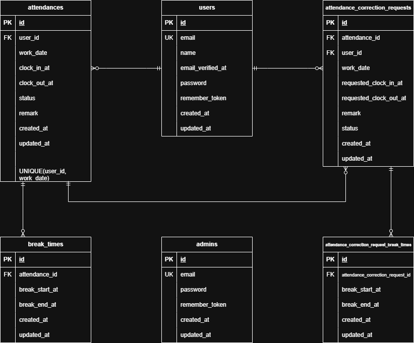

# attendance-management-app

## 環境構築

### Docker ビルド

1. リポジトリをクローンする。

```bash
git clone git@github.com:ユーザー名/リポジトリ名.git
```

2. プロジェクトディレクトリに移動する。

```bash
cd attendance-management-app
```

3. Docker コンテナをビルド・起動する。

```bash
docker compose up -d --build
```

---

### Laravel 環境構築

1. PHP コンテナに入る。

```bash
docker compose exec php bash
```

2. Laravel に必要なパッケージをインストールする。

```bash
composer install
```

3. 環境変数ファイルを作成する。

```bash
cp .env.example .env
```

※ `.env` ファイル内の DB 接続情報は、以下の設定になっていることを確認してください。

```env
DB_CONNECTION=mysql
DB_HOST=mysql
DB_PORT=3306
DB_DATABASE=laravel_db
DB_USERNAME=laravel_user
DB_PASSWORD=laravel_pass
```

4. アプリケーションキーを生成する。

```bash
php artisan key:generate
```

5. データベースのマイグレーション・シーディングを実行する。

```bash
php artisan migrate --seed
```

6. 権限エラーが出る場合は、以下を実行してください。

```bash
chmod -R 777 storage bootstrap/cache
```

---

## メール認証について

本アプリでは、Laravel Fortify を使用したメール認証機能を実装しています。

メール認証の確認には MailHog を使用します。

```txt
MailHog：http://localhost:8025
```

`.env` のメール設定は以下の内容になっていることを確認してください。

```env
MAIL_MAILER=smtp
MAIL_HOST=mailhog
MAIL_PORT=1025
MAIL_USERNAME=null
MAIL_PASSWORD=null
MAIL_ENCRYPTION=null
MAIL_FROM_ADDRESS=test@example.com
```

---

## テスト環境構築

本アプリでは PHPUnit による Feature テストを実装しています。

テスト実行時は `.env.testing` を使用します。  
クローン直後は `.env.testing` が存在しないため、以下の手順で作成してください。

### .env.testing の作成

PHP コンテナ内で、`.env.example` をコピーして `.env.testing` を作成します。

```bash
docker compose exec php cp .env.example .env.testing
```

作成後、`.env.testing` の以下の項目をテスト用に変更してください。

```env
APP_ENV=testing

DB_CONNECTION=mysql
DB_HOST=mysql
DB_PORT=3306
DB_DATABASE=demo_test
DB_USERNAME=laravel_user
DB_PASSWORD=laravel_pass

CACHE_DRIVER=array
SESSION_DRIVER=array
MAIL_MAILER=array
```

テスト用のアプリケーションキーを生成します。

```bash
docker compose exec php php artisan key:generate --env=testing
```

---

### テスト用データベースの作成

テスト実行前に、MySQL コンテナに入り、テスト用データベースを作成してください。

```bash
docker compose exec mysql mysql -u root -p
```

パスワードを求められたら、以下を入力してください。

```txt
root
```

MySQL にログイン後、以下を実行します。

```sql
CREATE DATABASE IF NOT EXISTS demo_test CHARACTER SET utf8mb4 COLLATE utf8mb4_unicode_ci;
GRANT ALL PRIVILEGES ON demo_test.* TO 'laravel_user'@'%';
FLUSH PRIVILEGES;
EXIT;
```

---

### テスト用マイグレーション

`.env.testing` が作成され、テスト用データベース `demo_test` が存在する状態で以下を実行してください。

```bash
docker compose exec php php artisan migrate:fresh --env=testing
```

---

### PHPUnit 実行

```bash
docker compose exec php vendor/bin/phpunit
```

---

## 使用技術

- Docker
- PHP 8.1
- Laravel 8.x
- MySQL 8.0.26
- nginx 1.21.1
- Laravel Fortify
- MailHog
- PHPUnit

---

## ER 図



---

## 機能一覧

### 一般ユーザー機能

- 会員登録
- ログイン
- ログアウト
- メール認証
- 勤怠登録
- 出勤
- 休憩開始
- 休憩終了
- 退勤
- 勤怠一覧表示
- 勤怠詳細表示
- 勤怠修正申請
- 修正申請一覧表示
- 承認待ち申請の確認
- 承認済み申請の確認

### 管理者機能

- 管理者ログイン
- 管理者ログアウト
- 日別勤怠一覧表示
- 勤怠詳細表示
- 勤怠情報修正
- スタッフ一覧表示
- スタッフ別月次勤怠一覧表示
- スタッフ別勤怠情報の CSV 出力
- 修正申請一覧表示
- 修正申請詳細表示
- 修正申請承認

---

## テスト用アカウント

`php artisan migrate --seed` 実行後、以下のアカウントが使用できます。

### 一般ユーザー

| 名前 | メールアドレス | パスワード |
| --- | --- | --- |
| 山田 太郎 | user1@example.com | password |
| 佐藤 花子 | user2@example.com | password |
| 鈴木 一郎 | user3@example.com | password |

※ 一般ユーザーはメール認証済みの状態で作成されます。

### 管理者

| メールアドレス | パスワード |
| --- | --- |
| admin@example.com | password123 |

### ダミー勤怠データ

シーディングにより、各一般ユーザーには直近5日分の勤怠データが作成されます。

```txt
出勤時刻：09:00
退勤時刻：18:00
休憩時間：12:00〜13:00
勤怠状態：退勤済
```

---

## URL

### 一般ユーザー

| 内容 | URL |
| --- | --- |
| 会員登録 | http://localhost/register |
| ログイン | http://localhost/login |
| 勤怠登録 | http://localhost/attendance |
| 勤怠一覧 | http://localhost/attendance/list |
| 勤怠詳細 | http://localhost/attendance/detail/{id} |
| 申請一覧 | http://localhost/attendance/requests |

### 管理者

| 内容 | URL |
| --- | --- |
| 管理者ログイン | http://localhost/admin/login |
| 管理者勤怠一覧 | http://localhost/admin/attendance/list |
| 管理者勤怠詳細 | http://localhost/admin/attendance/{id} |
| スタッフ一覧 | http://localhost/admin/staff/list |
| スタッフ別勤怠一覧 | http://localhost/admin/attendance/staff/{id} |
| 修正申請一覧 | http://localhost/stamp_correction_request/list |
| 修正申請承認画面 | http://localhost/stamp_correction_request/approve/{attendanceCorrectionRequest} |

### 開発用URL

| 内容 | URL |
| --- | --- |
| phpMyAdmin | http://localhost:8080 |
| MailHog | http://localhost:8025 |

---

## 補足事項

- メール認証確認には MailHog を使用します。
- テスト実行前に、テスト用データベース `demo_test` を作成してください。